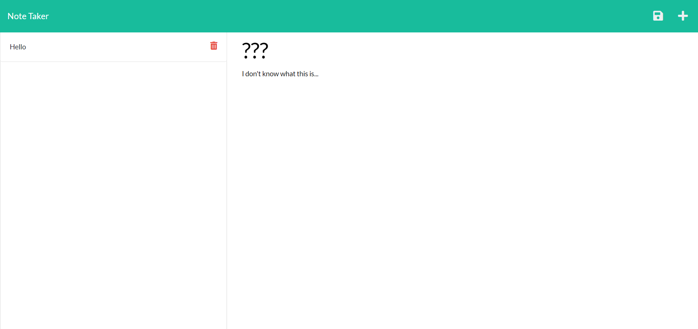

# Note-Taking-App

 

## Description

  This is an application that can accept some input from the user to take and save notes on a deployed webpage. The notes are saved to a json file that can be retrieved whenever the application is launched. When finished with a note, the note can be deleted from the webpage.

  ## Table of Contents

  - [Installation](#installation)
  - [Usage](#usage)
  - [Contributing](#contributing)
  - [License](#license)
  - [Tests](#tests)
  - [Questions](#questions)

  ## Installation

  To install this project, download the files from my repository at https://github.com/AndrewKamSki/Note-Taking-App. From there you can load in the server.js file in your favorite IDE. Run an NPM install in the console to load in the correct packages, then run a node server.js to start the application and begin entering data!

  You can also access the deployed webpage via the following link: 
  https://fast-gorge-90047.herokuapp.com/

  ## Usage

  Once you run the 'node server.js' the system will take you to the landing page. Click the 'get started' button to be directed to the next page.

  Here, you can enter a note title and text for the note. Once finished, you can click the save icon to save the note to the side bar. Click the '+' icon to start new note. To delete a note, click the trash icon next to it in the sidebar. 

  All of the routing for this project was done with express!

  
  

  ## Contributing

  No other contributors were on this project

  ## License
  The License being used is: MIT
  If you would like to read more on this please click the badge to navigate to the license page: 
  

  ## Tests

  No tests have been created yet for this project
  
  ## Questions

  If you would like to collaborate or have any questions feel free to contact me on my Github!
    - [My github](https://github.com/AndrewKamSki)